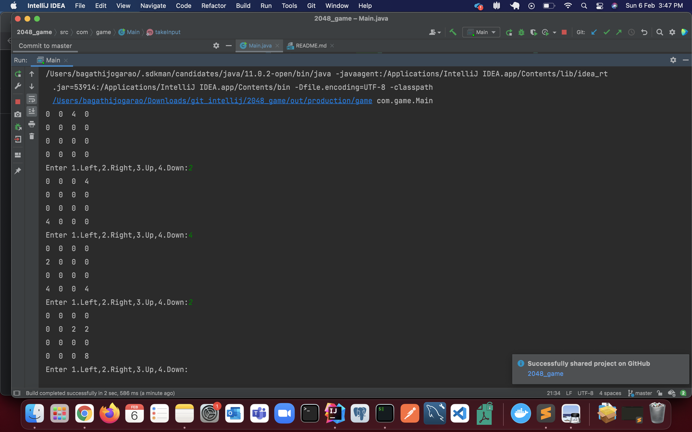

# 2048 Command Line Game

## Design:
## Everytime if the configuration of the grid changes then a new-number( 2 or 4) generated randomly in one of the empty cell (randomly).

## Methods used
### getEmptyCount()
### show()
       displays 4*4 grid
### getNewNumber()
      returns 2 or 4 randomly
### putNewNumber()
        finds number of empty cells in the 2D array
        generated some random number from 1 to Number_of_emptyCells
        assigns (2 or 4 randomly) to that empty Cell
### mergeRow()-
        takes a list and return merged list
        examples
         [2,4,4,8] -> [2,8,8]
        [2,4,8] -> [2,4,8]
### moveLeft()
        for every row
        make a list of numbers [n1,n2,n3,n4]
         merge each list seperately and get new merged list
         reassign the row to the main 2D array
        if no change happened dont put new element
### moveRight()
      same as moveLeft but just order changes
### moveUp()
      same as moveLeft but just order changes
### moveDown()
      same as moveLeft but just order changes
### isGameOver()
      checks whether there is any possible move or not ,if no move is possible  game ends
### takeInput()
      shows the menu and returns input 
### isSuccess()
      checks whether 2048 is present or not
      
      

